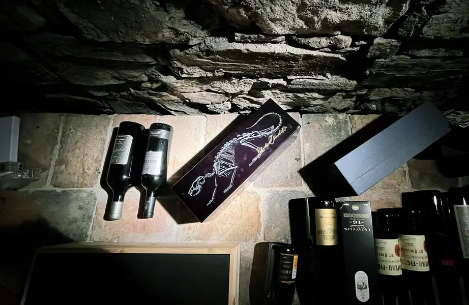
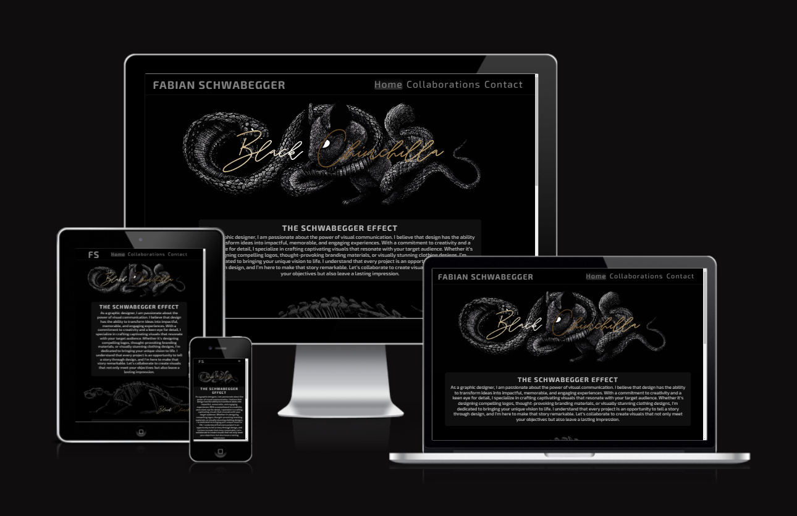
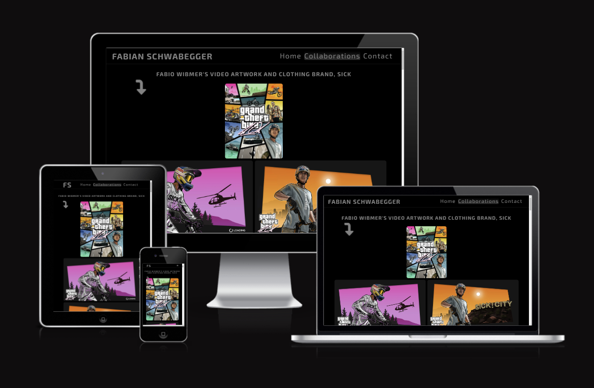
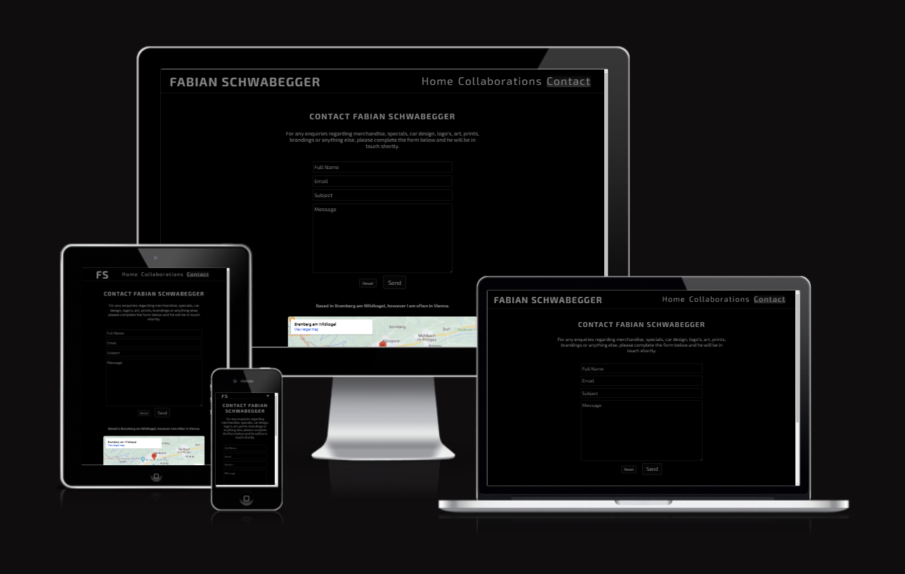
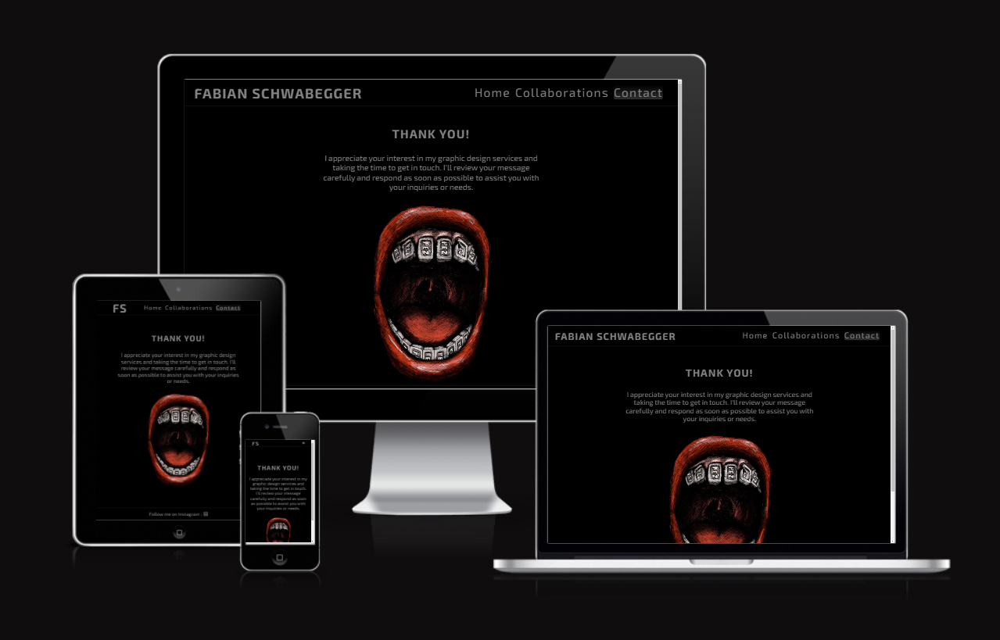
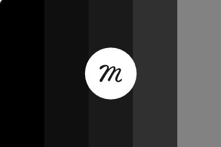
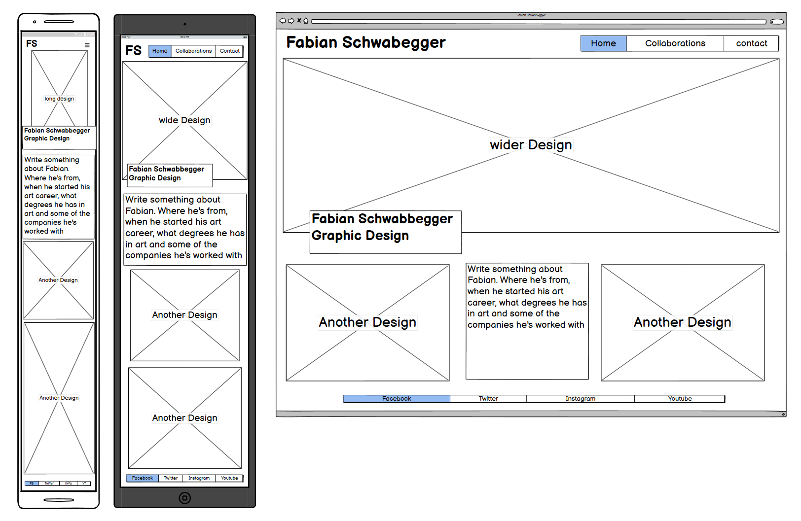
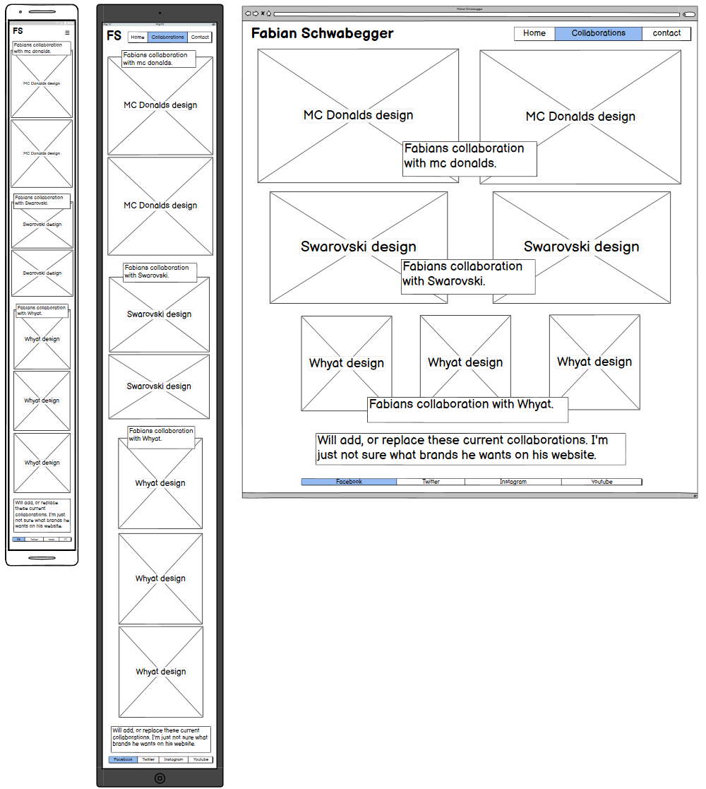
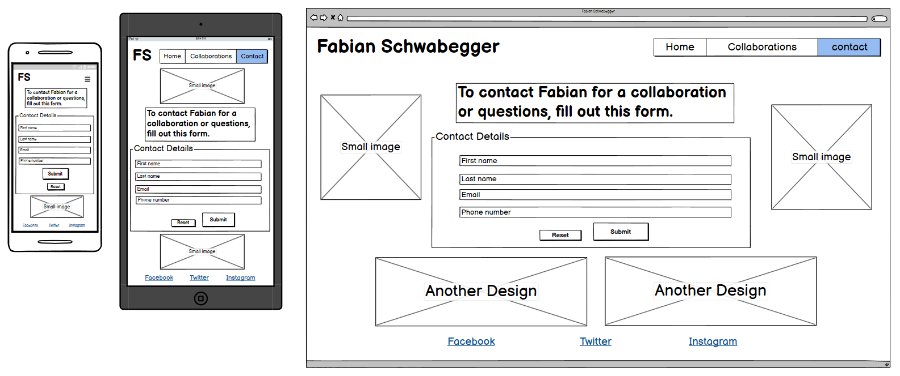
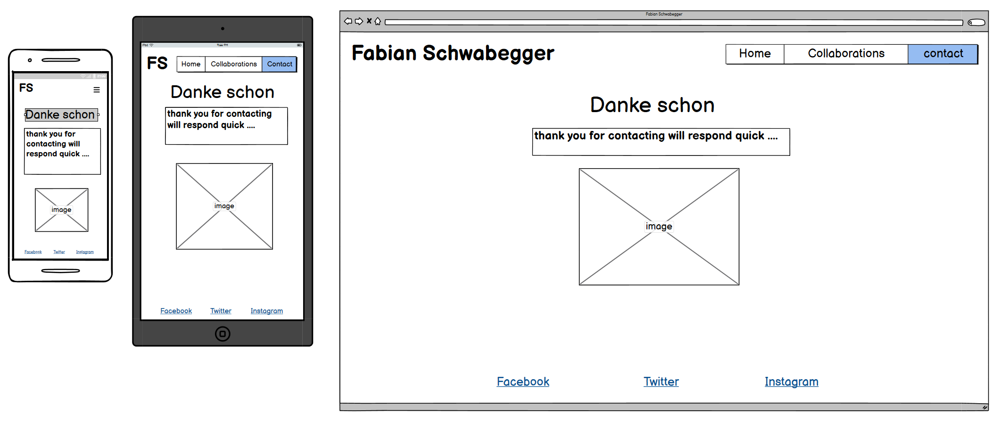

# Fabian Schwabegger

[Click on this link to visit the website](https://obiwanbonobi.github.io/PP1/)

 

# Content

- [Introduction](#introduction)
    * [User experience](#user-experience)
    * [My vision for the website](#my-vision-for-the-website)
- [Features](#features)
   * [Navigation](#navigation)
   * [Footer](#footer)
   * [Collaborations navigation](#collaborations-navigation)
   * [Home Page](#home-page)
   * [Collaborations page](#collaborations-page)
   * [Contact page](#contact-page)
   * [Contact send page](#contact-send-page)
- [Future features](#future-features)
- [Design](#design)
- [Technologies used](#technologies-used)
   * [Balsemiq](#balsemiq)
- [Testing](#testing)
    * [Validation HTML and CSS](#validation-html-and-css)
    * [Lighthouse test](#lighthouse-test)
    * [Testing on devices and browsers](#testing-on-devices-and-browsers)
- [Credits](#credits)

 

# Introduction

I embarked on the journey of creating a website for my partner, who is a graphic designer, with a profound sense of purpose. Recognizing his extraordinary talent as a graphic designer, I wanted to offer a dedicated platform that would not only honor his work but also provide a showcase for his remarkable skills. This website stands as a testament to our shared commitment to creativity and design excellence. It's a space where his artistic endeavors can shine and captivate, where clients can discover the transformative power of design. 

By crafting this online presence, I aim to assist in amplifying his reach and connecting him with a broader audience that appreciates the craftsmanship and ingenuity he brings to every project. It's a digital canvas where his talents can truly flourish, and I'm thrilled to contribute to this creative endeavor that continues to inspire us both.

## User experience

I've meticulously crafted this online space to ensure a seamless and engaging user experience. Ultimately, I want visitors to my website to feel inspired, informed, and connected. Whether they're seeking my partner's services, admiring his work, or just exploring the world of graphic design, I aim to provide an exceptional and memorable user experience that leaves a lasting impression.

## My vision for the website

The layout is intuitive and visually appealing, making it easy to navigate through and explore his work. I've optimized the site for all devices, ensuring that whether on a desktop, tablet, or smartphone, the content remains accessible and aesthetically pleasing. I've paid close attention to loading times to keep the user engaged and prevent frustration. 

Whether it's the captivating visuals or the carefully crafted text, I've strived to create a harmonious blend that provides valuable information. In addition, I've included a user-friendly contact form, and Fabian is committed to a swift response. I've placed a strong emphasis on accessibility to ensure that everyone, regardless of ability, can enjoy the site without barriers.

 

# Features

### Navigation

The navitagion bar is always visible at the top of each page, for easy navigation. It includes :
- on the left side are Fabi's initials on small screens and his full name on bigger screens
- on the right side is a burger icon on small screens and the full navigation menu on bigger screens
- I gave the navigation bar a barely visible line underneath to show a difference between navigation bar to the main section

### Footer

The footer is at the bottom of each page and it includes a link to Fabian's instagram account. I gave the footer bar also a barely visible line above to show a difference between the footer and the main section.

### Collaborations navigation

On the left top side in the Collaborations page, I've added a "go down" icon that navigates to different collabs in the page. This helps move around quicker and more clearly.

### Home page

I've kept the design of the home page simple. 
- My train of thought was to have Fabian's designs to be the main attraction throughout the website. 
- In the second paragraph, the collaborations bubble, I added a link to the collaborations page.

 

### Collaborations page

- Same as the home page, I wanted to keep Fabians desings the main attraction. 
- On the left top side is a down arrow to navigate through fabians designs.
- Every picture in each < div > is cropped to the same size, to keep the page looking clean.
- I seperated some of the desings in different < div > so when they are shown on bigger screens, they stay together.

 

### Contact page

- The contact page includes a form that can be filled out to get into contact with Fabian.
- It also includes a map of where Fabian is based.
- After you press the send button, you will be taken to a new page that says thank you.

 

### Contact send page

- This page will only show after you filled out the contact form.
- It has a short thank you message with another desing.
- It was the same layout as the other pages so you can easily navigate back to the other pages.

 

 

# Future features

I want to add javascript to all pages and make the whole site more interactive.
- I want to add a zoom in feature for all pictures
- I want to make a "entry" page with a large design that will take you to the main website when you first load the website
- I want to make the pages move right to left when you go to the next page to the right. And left to right when you go to the previous page.
- Add more collaborations
- I want to improve the collaboration navigation

 

# Design

- <b>Font</b> : With the help of the Code Institute, Love running project, I got my font from [google fonts](https://fonts.google.com/)
- <b>Icons</b> : Also with the help of the Love running project, I used the [Font Awesome](https://fontawesome.com/) website
- <b>Favicon generator</b> : I made my own favicon with [this website](https://favicon.io/)
- <b>Map</b> : I used [Google Maps](https://maps.google.com/) for the small map on the contact page
- <b>Image resizing</b> : I used this [Image resizer](https://imageresizer.com/) website to change my images
- <b>Gif</b> : I used [this website](https://ezgif.com/) to create a gif for my README

### Colour scheme

I kept the colour scheme very simple, because I wanted Fabian's designs to pop out.

 

# Technologies used

- The website is written in HTML and CSS only
- I did all my coding with the program VS Code, [Visual Studio Code](https://code.visualstudio.com/)
- All my code was uploaded to [Github](https://github.com/), to my [Github account](https://github.com/ObiWanBonobi)

### Balsemiq

The project started with Balsamiq, where I imagined the beginning of the website on all device sizes. I did end up deviating from the original imagination on balsemiq.

 

# Testing

Every link on all pages got tested on several devices and webbrowsers. The contact form has been tested as well and works as it should.

### Validation HTML and CSS

The home page had an initial error with the < footer > where I had put an < p > in a < ul >

The collaborations page also had an initial error where I had put my collab navigation in a < section > which needed an header I ended up changing it to < aside >

The contact page had no issues from the start

The contact send page did not have any issues as well

The CSS file did not have any issues as well

### Lighthouse test

The home page had an initial error where I had used < h3 > where I shoul've used a < h1 >. After I changed that it came back with this result :

The collaborations page also had an initial error where I had used < h3 > where I shoul've used a < h1 >. After I changed that it came back with this result :

The contact page didn't have any issues :

The contact send page also didn't have any issues :

### Testing on devices and browsers

I tested the deployed wedsite on several devices webbrowsers :
- Iphone 14
- Ipad gen 3
- Google pixel 7
- Samsung galaxy tab S6
- HP envy 
- PC build

 

- Google chrome
- Microsoft edge
- Apple Safari

 

# Bug fixes

- When I deployed the website for the first time with my facilitator David Calikes and fellow student Alihan Teker, the images weren't loading. We tried several "fixes" before getting to the correct bug fix :
    * We changed the image format from webp to jpg, however that didn't work
    * We checked on another device and webbrowser and it still didn't work
    * We ended up realising that it had to do with my file path, this is where we noticed I had added a / infront of the assets/images/... file path
- When I added a link to my collaborations page in the home page, I noticed it wasn't working. Turns out I had done the same thing as with the images. Accidentally added a / infront of the file path
- When I was adding the navigation in the collaborations page I noticed that the Footer link that goes to Instagram stopped working. 
    * I checked the code and didn't notice a mistake
    * I then checked on dev tools where I noticed that the Main element when a full 100% down and it basically make the footer dissapear behind it.
    * I went into my css file and noticed that I had set width and height to 100%. I changed those values and the footer was "visible" again
- The paragraph in the contact page wasn't changing with my css demands. I had accidentally placed a # instead of a . infront of my class name for this paragraph.
- I ended up changing the size for all images because they were taking too long to load. When I changed the images with the help of a website, I saved these images with the new name the website gave me, which had an space at the end of the name. So ofcourse it didn't work, I knew from the program that if you add a file with a space in it, it needs to be wrapped in " ". I ended up deleting the space.
- The Lighthouse test was coming back a little lower and I didn't know why [this forum helped me realise it was my chrome extentions](https://stackoverflow.com/questions/54126343/how-to-fix-unchecked-runtime-lasterror-the-message-port-closed-before-a-respon)
- In my last validation I added some videos to the collab page and I had left a style in the iframe in the html file, so I deleted that and added it to the css file.

 

<b>I have not noticed any existing bugs, since I fixed all the existing ones.</b>

 

# Deployment

The website was deployed to my account on GitHub pages. The steps I took to deploy the website went as followed: 
  - Go to my [GitHub repository called PP1](https://github.com/ObiWanBonobi/PP1)
  - In there, I navigated to the Settings tab 
  - From the source section drop-down menu, I selected the Master Branch
  - Once the master branch has been selected, the page will be automatically refreshed with a detailed ribbon display to indicate the successful deployment. 

You can see deployed wedsite [here](https://obiwanbonobi.github.io/PP1/index.html)

# Credits

- <b>Layout, contact form and code</b> : the navigation and footer layout, the contact form code and some of the basic code I partly got from the Code Institute learning program and projects, [Love Running](https://github.com/Code-Institute-Org/love-running-2.0) and Coding Coffee House
- <b>README</b> : a bit of the layout from the Code Institute Coding club sample, and the [Love Running project](https://github.com/Code-Institute-Solutions/readme-template), and from Siobhan Gorman's project [Sourdough Bakes](https://github.com/siobhanlgorman/Sourdough-Bakes)
- <b>README funtions</b> : got some ideas from cosmiccoincidence's [README](https://github.com/RE-SS3D/.github/blob/main/profile/README.md)
- <b>Images</b> : All images come directly from Fabin Schwabegger
- <b>Gif</b> : I got the gif in the readme idea from stumbling upon [this website](https://medium.com/@alenanikulina0/make-your-readme-better-with-images-and-gifs-b141bd54bff3)
- <b>Bug</b> : with the help of my facilitator [David Calikes](https://github.com/davidcalikes) and fellow student [Alihan Teker](https://github.com/Tekali7), we fixed a bug.
- <b>Learning online</b> : 
    * [This website](https://developer.mozilla.org/en-US/docs/Web/CSS/display) helped me understand the display funtion a little better.
    * [This forum](https://stackoverflow.com/questions/42273295/how-to-apply-linear-gradient-on-an-input-on-its-border-bottom-only) helped me how to use gradiant.
    * [This website](https://www.w3schools.com/cssref/pr_dim_max-width.php#:~:text=The%20max%2Dwidth%20property%20defines,width%20property%20has%20no%20effect.) helped me understand a little more how max-width/ -height works.
    * [This forum](https://stackoverflow.com/questions/53769927/is-an-aria-label-needed-for-basic-all-link-tags#:~:text=The%20aria%2Dlabel%20attribute%20on,alt%20attribute%20in%20image%20links.) and [this forum](https://stackoverflow.com/questions/73140303/is-using-a-label-enough-or-should-i-add-aria-attributes) helped me understand aria-label better.

- <b>Most of my credit goes to the Code Institute program where I made notes on every section and got most of my ideas and code from there.</b>